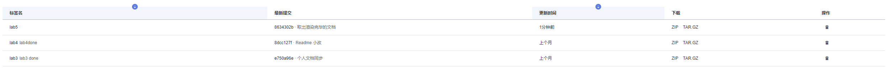

# 复旦大学2020-2021春季学期软件工程Lab

第二十四小组

成员：张明、王海伟、许同樵、袁逸聪

目前阶段：Lab5

服务器IP：121.37.153.119

前端端口为80可直接访问，直接在浏览器输入即可进入首页

超级管理员账号"admin"密码"admin"(超管账号自动生成，无视格式检测。但注册用户是必须使用学工号的)

用户身份根据学工号自动判定，6位为教师，11位为学生，学生学号根据第三位判断学位(1、2分别是博士、研究生，判定为研究生，3是本科生)

简单说明本次新增功能的使用：

1. 信用体系
   1. 信用分数显示在个人中心，在发生违规行为时自动扣除
   2. 用户支付所有罚款、或提交的恢复申请通过后，信用分恢复到100
2. 评价体系
   1. 用户还书后将创建一条待评论，对一个用户对一本书同时只会有一个评论
   2. 用户可以随时修改自己的评论，但删除评论后不能再评，只能下次借书再评
   3. 用户可以从书本详情页面进入讨论区，查看别人的评论，并在下面开展讨论，讨论不能修改，但用户自己可以删除
   4. 管理员可以在书本详情页面选择隐藏或恢复用户的评论

[toc]

## 项目完成情况

- 项目需求

  1. 新增功能：参见提交的需求文档.pdf
  2. 服务拆分：重构后端，改用微服务架构

- 代码检查结果


- 代码tag截图




## 需求规划

- 信用体系


- 评论讨论


## 主要功能截图

- 个人中心页面


- 信用申请审批


- 评论讨论


- 系统记录


## 单元测试覆盖率


## docker部署截图

服务器docker ps


没有在docker中为每个service开启独立数据库

但service对数据库的使用是隔离的，想要获取其他service管理的数据需要使用服务间通信

## 微服务架构

灰色框表示服务，期中的蓝色方框表示服务内部结构关系

而橙色方框表示供所有其他服务调用的工具性资源


### 架构演进

- 预约逾期的处理

在lab4中，预约逾期就是我们遇到的设计难点。我们认为预约之所以需要逾期，是为了及时释放图书资源，让其他用户能借到书，所以预约逾期后应当自动取消预约，归还书籍资源。(而在借书上，书籍还在)
所以，管理员发送提醒，在预约逾期上，并不是提醒用户自己取消预约，而是通知用户，你的预约已经无效了。
在lab4中，我们的处理方式是在副本被访问的接口中，调用遍历数据库，找出所有逾期预约的方式。但是如浏览书库这样无权限要求的高频操作，易引发并发问题，导致预约逾期被重复计算。
lab5中，我们将遍历数据库的操作改为由borrow-service自动定期执行，在上一次结束后10秒开启下一次，将操作串行化。

- 副本信息与借还业务解耦

lab4中我们在副本信息中维护了借阅状态、借阅时间、到期时间等信息，供借阅功能随时取用。副本与借阅功能紧密地耦合在一起，在服务拆分时显得很奇怪。
因而拆分服务后，副本只存储其作为一本实体书的信息，如所在分馆。而borrow-service将独立地维护借阅相关内容。

## 小组成员个人实验报告

### 张明

#### 1、负责任务

（1）微服务框架的搭建

（2）所有新增微服务的单元测试

#### 2、微服务框架

在lab4的研究的基础上，我们成功地搭建了基于Eureka平台的微服务系统，并采用RestTemplate作为服务间通信的手段。整个微服务结构展示在uml图中，主要的service包含了UserService，BookService，violaitonService，CommentService以及LogService。服务之间通过RestTemplate进行调用。

#### 3、单元测试

在进行本lab的单元测试工作时，因为涉及到了服务之间的调用，我主要采用了Mock测试的方法进行单元测试，在数据层面之外进行了后端方法功能的逻辑测试。以BookServiceTests为例：

```java
@Mock
private BookRepository bookRepository;
@Mock
private CopyRepository copyRepository;

@Mock
private RestTemplate restTemplate;

@InjectMocks
private BookService bookService;
@InjectMocks
private CopyService copyService;
```

通过@Mock注解，虚假声明一个BookRepository，同时通过@InjectMocks注解，声明mock注入的服务

通过Mockito.when().thenReturn()方法，来控制service中的方法执行到mockRepository时的返回值，具体实现可以看这个例子：

```java
@Test
void getBookByRightISBN(){
    String isbn="1000000000";
    Book mockBook = new Book();
    mockBook.setISBN(isbn);
    Mockito.when(bookRepository.findBookByISBN(isbn)).thenReturn(mockBook);
    Mockito.when(copyRepository.countCopiesByISBN(isbn)).thenReturn(5);
    Mockito.when(copyRepository.countCopiesByISBNAndStatus(isbn,"在库")).thenReturn(3);
    HashMap<String, Object> map = bookService.getBookByISBN(isbn).getMap();
    assertEquals("获取书籍成功",map.get("message"));
    System.out.println(bookService.getBookByISBN(isbn).getMap());
}
```

可以看到，Mockito方法让被mock注解过的bookRepository在执行findBookByISBN(isbn)时return到一个自定义的mockBook上，这样就可以手动控制数据库返回的结果，进行不同情况的测试。

但这样的测试缺乏了对数据库方法层面的确认，如果在不相信JPA的功能的时候，还需要进行一定的集成测试的工作。

最后，感谢三位组员的付出！

### 袁逸聪

#### 工作内容

1. 服务拆分设计、业务架构
2. 后端所有功能重构为微服务架构的实现(许同樵也实现了一些功能，在他的部分有说明)
3. 中期与末期报告
4. user-service中UserService的单元测试
5. 前后端集成测试(与许同樵一起)
6. 泳道图、UML图等的绘制

#### 后端重构过程中对RestfulApi的感悟

在重构的过程中，我深刻体会到了restful api的价值，一个明确约定、不查看代码就可以放心使用的数据接口，在微服务的开发过程中至关重要。不过迫于时间压力，并没有严格参照restful api实现，如果业务量再多出一倍，目前这种相对随意的接口约定方式就要给开发带来巨大困难了。

#### 未解决的问题

1. 目前的实现方式，仍然存在并发请求导致意外状况的可能。同时，使用微服务架构后，部分成功部分失败的服务调用也将导致业务大乱特乱。可惜没有时间采用请求队列、服务间事务等方案了。
2. 微服务+docker部署后，遇到了springboot静态资源无法访问的问题，导致图书封面无法获取。我们当前采用匹配图片访问接口，用流传输方式获取文件后返回。这个方案解决了燃眉之急，但我们仍不知道为什么lab4在docker容器中没有可以访问、lab5本地运行微服务也可以访问的静态资源会出问题。

### 许同樵

#### 1、参与内容

##### （1）新功能的所有前端实现
值得一提的是，我使用了类似知乎网页端的评论显示方法，将评论详情设为了一个提示框，在提示框内显示进一步的讨论。同时，这样一来可以减少后端的接口访问次数，增强稳定性。提示框由我使用的框架iviews提供，为标签为<Modal>，它提供了一系列方法，原本用于全局提示，我将其用作了类似附属页面的功能，在关闭时直接点击右上角的叉即可，以避免多分一页带来的逻辑上的麻烦。

##### （2）重构过程中前端的接口改变、修改前端bug
由于使用了多个端口，因此在vue.config.js中设置了多个proxy解决跨域问题，nginx.conf同理
另外修改了部分遗漏的bug，分页由前端完成，由于分页会遇到异步问题，因此观察应观察被分页数据。当数据改变时，要重新将页数返回至第一页。

##### （3）参与了后端部分内容的编写，涉及Browse、Copy的小部分功能，Comment的框架和部分功能
主要是修改了前端接口对接时遇到的问题，顺便写了下后端。其实在后端已架构好的情况下写是容易的（如果架构包括想好这个东西要怎么实现的过程的话），但是本次架构我几乎未参与，而且我觉得挺麻烦的。其实软件调试最大的困难不在于找这个bug的位置，而是找到bug后发现一改动全身的情况……另外，我觉得微服务实在是一个超大架构下才需要考虑的东西，这一个lab5我们直接重构整个lab，其实根本做不到所谓测试驱动，因为根本来不及，边写边构建的时间占了大多数。
另外，如果能自动生成repository类就好了，不知道有没有这个功能，现在还得每次重创建一个。

##### （4）参与了集成测试
前后端统一测试，使用了与yyc结对编程的方式。感觉华为云的流水线功能太拉了，bug一堆，动不动就失败。有幸我组有whw在服务器上有脚本，可以做到在服务器上使用脚本部署、显示报错内容。顺便由于云端测试的效率比本地低，我测试了一下自己使用前端的水平。从自我评价的角度来看，我还行，能手敲比较复杂的前端功能并保证不出现严重bug。

#### 2、部分关键代码

##### 分页中的主要方法切换页面（curPageComments为当前页面显示的评论，comments为所有的评论）

```javascript
changePage(index){
    let _start = ( index - 1 ) * this.pageSize;
    let _end = index * this.pageSize;
    this.curPageComments = this.comments.slice(_start,_end);
}
```

### 王海伟

#### 1、负责任务

（1）微服务初期框架打通

（2）微服务架构docker设计

（3）自动化部署

#### 2、微服务框架

在lab4当中没有调通框架，最后直接放弃选择推进业务，在这次lab当中，我依旧是选择了Eureka，在迭代初期构建了一个简单的demo，选择了Eureka+RestTemplate，完善了idea开发流程，方便后续移植标准化。粗略的完成了user-service的移植尝试，并由其他同学完成后续的开发

#### 3、微服务架构docker设计

在微服务的开发当中，由于后端大量的RestTemplate调用，各个服务都需要和数据库接洽，和前端对后端调用的端口和接口复杂化，原本旧的docker框架（前段，后端，数据库）在部署的时候需要改变后端yml文件设置，前端nginx调用转发，确保容器之间的联通，才可以正确部署。

但是在微服务的docker部署上，这样的方式并不是合适了：

1. 后端的RestTemplate调用在本地开发的时候是通过不同端口来调用不同服务，要修改localhost的调用为服务相应的docker名字

2. 各个后端服务的sql的url配置都需要改变

3. 前端的调用也需要根据不同的服务修改localhost的调用为服务相应的docker名字

如果按照原有方式部署的话，在每次编译部署前都需要做出这些修改，并且push到devcloud后编译，本地测试又需要改回来，相当复杂。

所以这里有一个需求，docker之间需要可以通过localhost访问到其他的容器

我当时是想了几种方案

第一种是让docker之间互联，直接使用links，但是docker各自依旧使用不同的ip，对localhost依旧不成功

第二种是尝试固定ip，但是在bridge（docker默认网络模式）下无法享有同一个ip

第三种方案是使用host网络模式

```
host mode networking can be useful to optimize performance, and in situations where a container needs to handle a large range of ports, as it does not require network address translation (NAT), and no “userland-proxy” is created for each port.
```

直接让docker享有host的ip，抢占host的端口，需要注意服务器的端口占用问题

值得注意的是，host模式只支持linux上的docker engine

```
The host networking driver only works on Linux hosts, and is not supported on Docker Desktop for Mac, Docker Desktop for Windows, or Docker EE for Windows Server.
```

这就导致了在本地测试docker是没有意义的（我们会有9个docker容器，本地跑电脑也受不了。。。），所以我也单独加了一个sql的docker compose方便本地测试

#### 4、自动化部署

完成了docker的架构设计就直接部署了，需要在远程端口测试。

首先是预备工作，我在本地搭建了一个docker所需要的文件夹框架，大致是项目根目录下有compose文件，前端文件，数据库文件夹，后端文件夹（包含所有服务），以及各个dockerfile和需要的配置文件，直接scp上传到服务器

然后华为云上设置流水线，这部分和以前差不多，但是发现了一个以前没有注意的问题，前端在部署的时候，由于devcloud不支持传送文件夹，传输的是单个包，导致前端的打包出的文件夹需要压缩传输，然后shell脚本来解压缩，这里的问题是解压不会覆盖原来的文件夹，所以这里在解压前需要加一个`rm -rf ./piblic`（写成``rm -rf /`就好玩了。。。）

最后我在远程端写了两个脚本，一个是直接看得到所有docker后台的脚本，一个是直接启动（不放心华为云），看后台方便调试。

然后就是需要重写nginx脚本，感谢前端同学许同樵基本写完了（前端为了区分不同的服务有自己的接口代理模式），我接手之后改了几个错误就可以顺利运行

最后，感谢几位同学的幸苦付出
# StrangeLibrary
