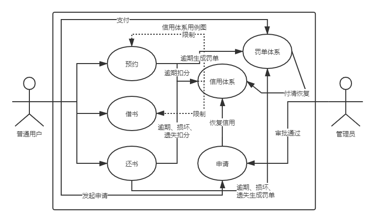
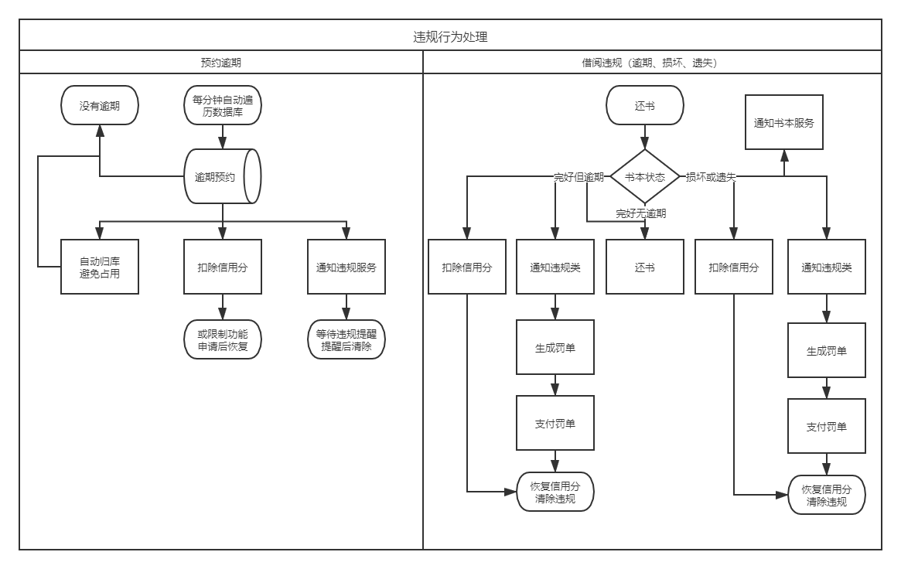
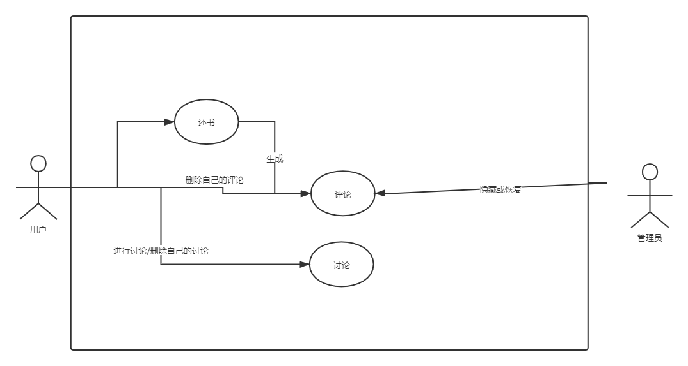
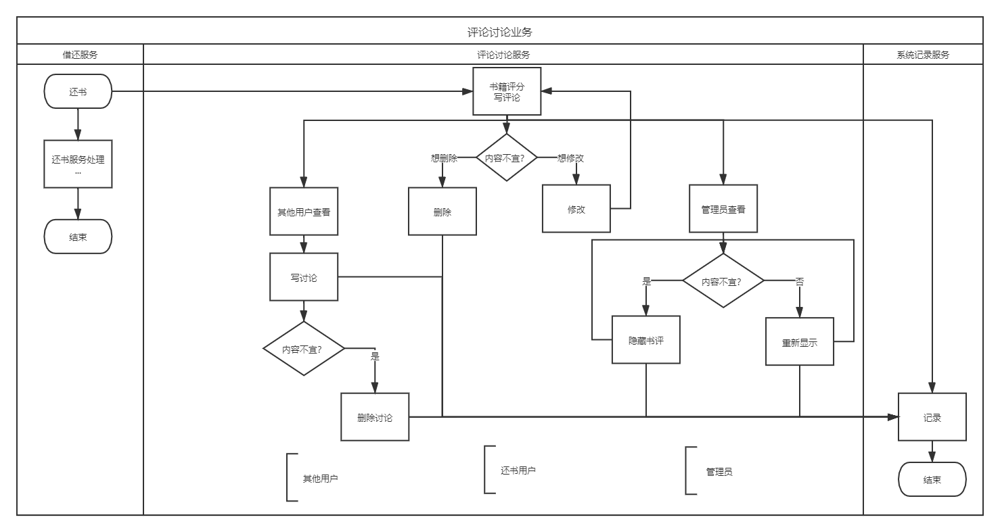

# Lab5需求分析报告

19302010020 袁逸聪

## 信用体系

1. 需要搭建用户信用体系，对违规操作扣分，根据分数限制功能
   1. 用户初始具有100分
   2. 预约逾期-10分，借书逾期-20分，损坏图书-30分，丢失图书-40分
2. 分数低于50时禁止预约，分数为0是不能借书
3. 用户可以向管理员写申请，通过后恢复分数到100
4. 为激励用户支付罚款，付清所有罚款也可以将分数恢复到100

前端需要新增个人中心显示信用分、打申请、审批申请的UI

主要逻辑在后端业务中实现

## 评论讨论

1. 用户可以对借阅过的书本发布评论，满分5分，使用星级UI
2. 用户可以删除不满意的评论(我们额外补充了修改评论的功能)
3. 用户可以对书本讨论区的评论发布讨论，一条评论对应多条讨论
4. 用户可以删除不满意的讨论
5. 管理员可以隐藏、恢复显示不合适的评论
6. 展示时需要分页

- 一个用户和一本书在同一时间最多有一条评论，评论删除后重新借阅并归还后可以再次评论

前端需要在新增评论讨论的显示、在用户功能中新增评论管理的页面

后端需要为以上页面提供接口

